# Machine and Deep Learning: Basic ML and DL model from Scratch in Python3

This project is my attempt to understanding and implementing some of the major Machine Learning and Deep Learning models and algorithms.

## Abstract and Disclaimer

I began this project with **two goals**: Use my recently acquired **knowledge on Python 3** on a concrete project and **learn more on Machine and Deep Learning**. I began with only basic Python 3 skills and little to no knowledge of Machine or Deep learning. I decided to go for a **" From Scratch" approach** as I wanted to focus more on **understanding the theory** and math behind those models, rather than "just" spend time on learning how to use popular frameworks such as **TensorFlow or SKlearn**.

That said, don't expect the **best performances or accuracy** in those models. A lot of largely used **complex optimization and features engineering are not implemented/used**. I think it was crucial to understand the basic theory and see what a "basic implementation" can do to understand how each optimization helps the model.

>**Note:** This work is a solo project and I spent at the time only two weeks on it. Each model didn't have more than one or two iterations on it. Keep in my mind this is a student side project, but all the links in the "Ressources and Credits" are way better resources if you are searching to get into Machine or Deep learning.

## How to Setup and Run

### **Step 1** : get a proper **Python 3.x** install.

I included in the "Ressources" directory, a **shell script** that gets a **miniconda python** (current 3.7.4) and install it. But feel free to use any python 3.x install you like. But be aware I only used this one during all this project's development.
`$> sh ./Ressources/Python3_installer.sh install-python`

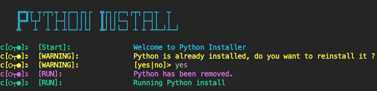
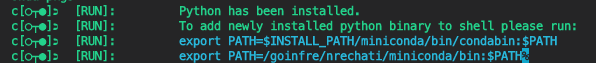

### **Step 2** : Install packages

Few external packages are used in those models :
- **pandas** : Mostly to get data from CSV files
- **numpy**: Main package used to work with data and arrays
- **matplotlib**: Tool to display and plot data and results
- **Colorama** : Just to make things fancy
- **sklearn** : (Optional), Only used in test.py files to see differences between my models and sklearn ones.

> Install using pip : `$> pip install numpy pandas matplotlib sklearn colorama`

### **Step 3** : Run it !

Then simply going to one of the model directories and run it. In general, every model will have :
- **The Model as a class**: Will get the data, be able to be trained, then predict and display results.
- **Dataset**: I developed those models with toy datasets, some workaround could be needed to fit other ones. *(i.e Those models are my understanding and implementation of them, not a tool to be largely used on concrete ML/DL use case on a large scale)*
- **Tools functions**: Few functions or other class relevant for the model to work
- **A *test.py* file**: That get some data, and show how the model reacts to it. Basic steps if you want to play with it are: instantiate the model, then *fit* it, then make him *predict*

>**Note**: Program was built on **macOS Mojave** and I know there is some **workaround to do to run on Linux** as well (mostly for python3 installer)

## Models and Features

### Linear Regression

- **Model:**
For this linear regression, the goal is to use training data to train our model (cf. *Gradient Descent* part below), then predict ouput *Y* for new input *X* by using our trained *H* function (cf. *Hypothesis* part below)

-  **Hypothesis and Prediction :**

As an accurate predictions from the model is our main goal, making good hyptothesis is crucial. The hypothesis refers to the *H* function in the model presented. Training the model will tweak values in it, that will define our hypothesis coefficient, but not the *"form"* of it. For a single feature linear regression, we can asssume our prediction will follow a line of equation :

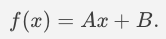

To suit our model we introduce the theta matrix. Theta is the matrix our model will change over iteration while training. And then use it's coefficients in the *H* function. We then have

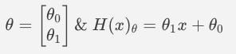

Going further , we will add a theta coefficient for each feature to end with

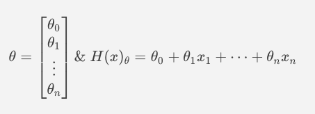

Where X matrix is the value for each feature in one example of our Dataset.
In the future we will use a vectorized form of ***H***

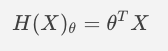

>**Note:** Benchmarking and choosing the good hypothesis in a model is a huge part of it's performance. Using **polynomial factors** or more complex ones can greatly **improve accuracy**. I did read a lot toward those, and also the problem of **overfitting** and the ***"bias - variance"*** problem. But didn't implemented them is this project. As I feel like this his something related to a precise model on a precise dataset and **I wanted a more generic model**.

-  **Cost function and Fitting :**

After defining what is our hypothesis, we'll introduce the **Cost Function**. The idea behind it is to quantify the error of our model to be able to train it afterward. And to do that, our cost function will be the **Mean Squared Error** between prediction and real example from the dataset.

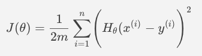

Thus, **fitting** or *"training"* the model will result in trying the to modify theta to reach a minimum for the cost function of the model.

-  **Linear Gradient Descent :**

The more features, the higher the dimensions our our matrices grow. Thus using gradient to define *"wich way "* values of theta need to go to aim for the needed minimum of our cost function yield good results. Our ***fit*** function will then be defined by

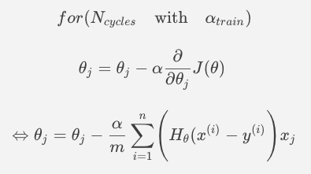

or the vectorized form :

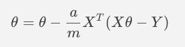

>**Note:** We see that alpha and Ncycle will have a big impact in the training process. But they also introduce the problem of under and overfitting. So even if they will be hardcoded values in the test files, playing with them and knowing their relations to the model is key.

- **Single Feature Results**

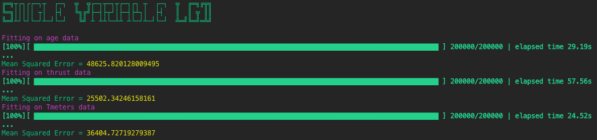
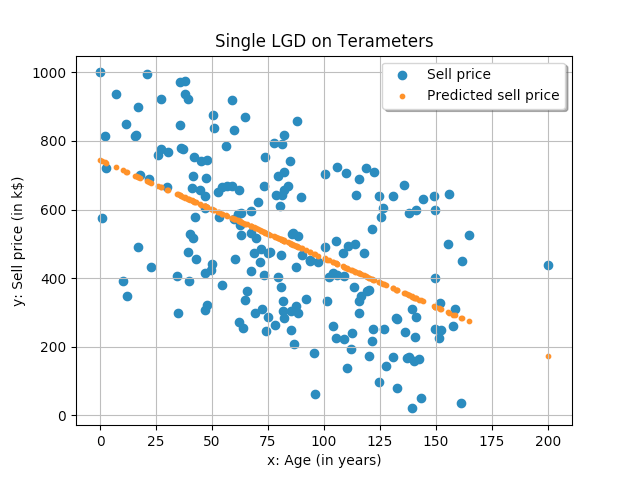

- **Multiple Feature Results**

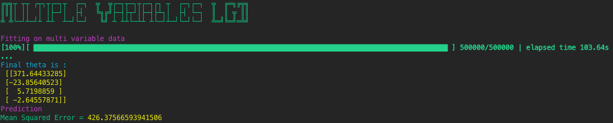
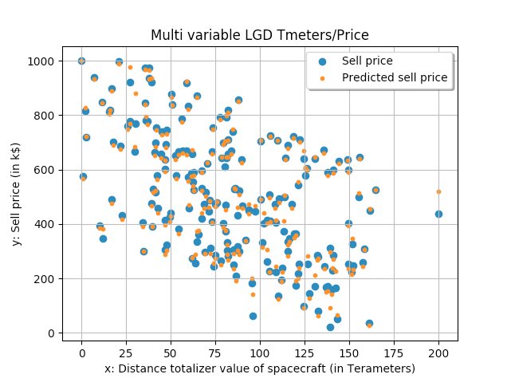

- **Regularization**

Lorem Ipsum

### Logistic Regression (for Classification problems)

### Decision tree (for Labels classification)

### Neural Network

## What's Next?

I did have a **great time** getting into Machine and Deep Learning by doing this project. I know there is still **a lot to discover and implement** to improve my skill, knowledge, and understanding of the subject. Thus I will probably **keep spending some time on it**, mostly toward **implementing a neural network** with the same "from scratch' mentality.

After implementing a neural network, I think I'll spend some time on **increasing accuracy and optimizing my models**. And try to learn **issues residing in those "basic" model** and finding **ways to improve them**, like with *regularization*. And the last step would be **to generalized to any type of inputs** to be able to use them more as a tool for any dataset. I also want to spend some time on all the concepts behind **Feature Engineering** as I think choosing the good dataset, and the good feature is a **key component of machine/deep learning**.

## Ressources and Credits

I relied on a lot of really helpful resources to achieve this.
- **42AI association**: Association working toward a lot of ML and DL cool stuff @42 Paris, they provide nice BootCamps and resources to get in AI and Python in general.
- **Coursera/Machine Learning course offered by Stanford University** : [Link here](https://www.coursera.org/learn/machine-learning). Real great "theory focused" machine and deep learning course
- **Python Official Doc** : [Python.org](https://www.python.org/) Really clear documentation about python and packages
- **SKlearn documentation** : [Website](https://scikit-learn.org/stable/). Cool ML/DL Framework with good documentation
- **3Blue1Brown** : [YouTube Channel](https://www.youtube.com/watch?v=aircAruvnKk&list=PLZHQObOWTQDNU6R1_67000Dx_ZCJB-3pi) Great playlist upon Neural Network Gradient Descent

## About Me

My name is **Nicolas** and I'm a curious 25 y/o **french engineer**. I **graduated in 2017** as an aeronautics engineer from **ESTACA** with the *"Avionics and Flight commands"* specialty. As I though **software development** was also a key behind engineering to **push technologies** in a lot of fields, I integrated **42** in Paris for now 1.5 years to get some **C/C++ and Python skills**.

## Update

**Last Update** of this repository and README.md was made on 02/07/2020
